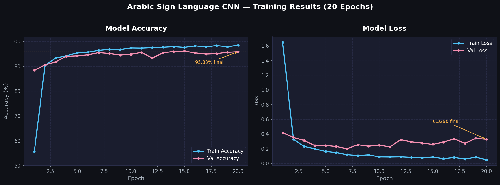

# Arabic Sign Language Translator 🤟

A deep learning system that recognizes **32 Arabic Sign Language (ArSL) gestures** in real time using a Convolutional Neural Network trained on the ArASL_Database_54K dataset.

---

## 📌 Project Overview

| Item | Detail |
|------|--------|
| Task | Arabic Sign Language Recognition |
| Model | 4-layer CNN (TensorFlow / Keras) |
| Input | 64×64 RGB image |
| Classes | 32 Arabic letters & common signs |
| Accuracy | **95.88%** on test set |
| Dataset | ArASL_Database_54K_Final (~54K images) |

---

## 🧠 How the Model Works

The CNN processes each hand-gesture image through four convolutional blocks that extract visual features (edges → shapes → patterns), followed by fully connected layers that map those features to one of 32 Arabic letter classes.

```
Input (64×64×3)
   → Conv2D(32) + MaxPool      # low-level features
   → Conv2D(64) + MaxPool      # mid-level features
   → Conv2D(128) + MaxPool     # high-level features
   → Conv2D(64)                # refinement
   → Flatten → Dense(64) → Dense(32, softmax)
```

Total trainable parameters: **234,720**

---

## 🗂️ Project Structure

```
arabic-sign-language-translator/
│
├── training.ipynb         # Model architecture & training (requires dataset)
├── inference.ipynb        # Load model, predict, visualize (no dataset needed)
│
├── model/
│   └── SL.h5              # ⚠️ Not included — download separately (see below)
│
├── results/               # Saved output images (auto-created at runtime)
│
├── .gitignore
└── README.md
```

---

## 🚀 How to Run Inference

### 1. Install dependencies

```bash
pip install -r requirements.txt
```

### 2. Download the model

> 📥 [Download SL.h5 — Google Drive](https://drive.google.com/file/d/1V1lhPQAdStQspvMA2EoSGzQP3VWgtC0p/view?usp=drive_link)

Place it at:
```
model/SL.h5
```

### 3. Open the inference notebook

```bash
jupyter notebook inference.ipynb
```

The notebook lets you:
- Predict from a **single image**
- Visualize **batch predictions** in a grid
- Run a **live webcam demo** (press `q` to quit)

---

## 🏋️ Training (Optional)

If you want to retrain from scratch:

1. Download the [ArASL_Database_54K_Final dataset](https://www.kaggle.com/datasets/gannayasser/arabic-alphabets-sign-language-dataset-arasl)
2. Update `DATASET_ROOT` in `training.ipynb`
3. Run all cells — model is saved to `model/SL.h5`

> ⚠️ The dataset is **not included** in this repository.

---

## 🔤 Supported Classes (32 Signs)

| Index | Letter | Index | Letter | Index | Letter | Index | Letter |
|-------|--------|-------|--------|-------|--------|-------|--------|
| 0 | أ | 8 | ذ | 16 | ظ | 24 | ن |
| 1 | ب | 9 | ر | 17 | ع | 25 | ه |
| 2 | ت | 10 | ز | 18 | غ | 26 | و |
| 3 | ث | 11 | س | 19 | ف | 27 | ي |
| 4 | ج | 12 | ش | 20 | ق | 28 | ة |
| 5 | ح | 13 | ص | 21 | ك | 29 | ال |
| 6 | خ | 14 | ض | 22 | ل | 30 | لا |
| 7 | د | 15 | ط | 23 | م | 31 | ئ |

---

## 📊 Results

Training accuracy and sample prediction outputs are saved to the `results/` folder after running the notebooks.

### Final Evaluation on Test Set

| Metric | Value |
|--------|-------|
| **Accuracy** | **95.88%** |
| **Loss** | 0.3290 |
| Test steps | 423 batches |
| Inference speed | ~55ms / step |

### Training Curves (20 Epochs)



Trained for **20 epochs** — accuracy improved steadily from **55% → 98.48%** on the training set, and **88% → 95.88%** on validation. Loss dropped consistently from 1.64 down to 0.05, confirming stable learning with no overfitting.

---

## 🛠️ Tech Stack

- Python 3.9
- TensorFlow / Keras
- OpenCV
- NumPy
- Matplotlib

---

## 👨‍💻 Authors

Graduation Project — Cairo Higher Institute for Engineering, Computer Science and Management

**Team (Batch 2019):**

1. Mohamed Mahmoud Salah Hammady *(Team Leader)*
2. Khaled Waleed Ramadan
3. Mudather Ahmed Gaber
4. Eman Mohsen Mohamed
5. Ahmed Mahmoud Hashem

---

## 📄 License

This project is for academic use only.
